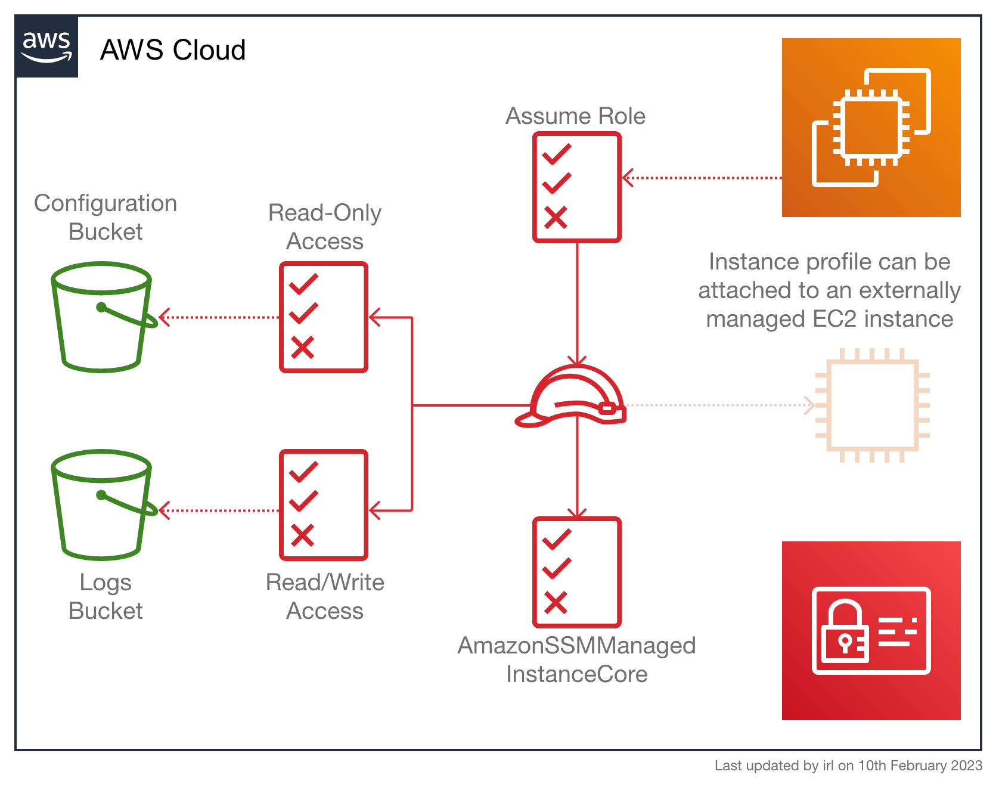

<!-- markdownlint-disable -->
# terraform-aws-ec2-conf-log
[](https://gitlab.com/sr2c/terraform-aws-ec2-conf-log/-/pipelines)
[](https://gitlab.com/sr2c/terraform-aws-ec2-conf-log/-/tags)
[](https://gitlab.com/sr2c/terraform-aws-ec2-conf-log/-/starrers)
[](https://gitlab.com/sr2c/terraform-aws-ec2-conf-log/-/forks)
<!-- markdownlint-restore -->
[![SR2 Communications Limited][logo]](https://www.sr2.uk/)

[![README Header][readme_header_img]][readme_header_link]
<!--

  ** DO NOT EDIT THIS FILE
  **
  ** This file was automatically generated by the `build-harness`.
  ** 1) Make all changes to `README.yaml`
  ** 2) Run `make init` (you only need to do this once)
  ** 3) Run`make readme` to rebuild this file.
  **
  ** (We maintain HUNDREDS of projects. This is how we maintain our sanity.)
  **

-->

Terraform module to deploy a pair of S3 buckets, one for configuration and one for logging, along with the necessary
IAM role and instance profile to allow for EC2 instances to interact with the buckets. The instance profile will also
include the `AmazonSSMManagedInstanceCore` policy to allow the use of SSM.



---
It's 100% Open Source and licensed under the [BSD 2-clause License](LICENSE).

## Usage
### Simple Example

```hcl
terraform {
  required_providers {
    aws = {
      source  = "hashicorp/aws"
      version = "~> 4.0"
    }
  }
}

provider "aws" {
  region = "us-east-2"
}

module "ec2_conf_log" {
  source = "./.."
  namespace = "eg"
  name = "ecl"
}

data "aws_availability_zones" "available" {
  state = "available"
}

data "aws_vpc" "default" {
  default = true
}

data "aws_subnet" "default" {
  availability_zone = data.aws_availability_zones.available.names[0]
  default_for_az = true
}

data "aws_ami" "ubuntu" {
  most_recent = true

  filter {
    name   = "name"
    values = ["ubuntu/images/hvm-ssd/ubuntu-focal-20.04-amd64-server-*"]
  }

  filter {
    name   = "virtualization-type"
    values = ["hvm"]
  }

  owners = ["099720109477"] # Canonical
}

module "instance" {
  source                      = "cloudposse/ec2-instance/aws"
  version                     = "0.45.0"

  subnet                      = data.aws_subnet.default.id
  vpc_id                      = data.aws_vpc.default.id
  ami                         = data.aws_ami.ubuntu.id
  ami_owner                   = "099720109477"
  assign_eip_address          = true
  associate_public_ip_address = true
  disable_api_termination     = false
  instance_type               = "t3.medium"
  instance_profile            = module.ec2_conf_log.instance_profile_name

  namespace = "eg"
  name = "ecl"
}
```

### Perform configuration

While this module does not prescribe a particular way of configuring the instances, one approach is to use a
cron job to regularly update the instance from the S3 bucket. It is important here to consider race conditions
where only part of an update has been pushed to the S3 bucket but not all objects are there yet. It may make
sense to upload an archive to S3 and download that as a single object rather than uploading multiple objects.

Example crontab:

```crontab
*/2 * * * * root /bin/bash /root/configure.sh &>/dev/null
```

Example configurations script:

```shell
#!/usr/bin/env bash

set -e

aws s3 cp s3://example-bucket-name/default /etc/nginx/sites-enabled/default

systemctl reload-or-restart nginx
```

The bucket name can be templated at instance creation time, with the crontab and script installed via cloud-init.

### logrotate

While this module does not prescribe a particular way of submitting logs from the instance to the logs bucket,
one method is to use logrotate. The following example works on an Ubuntu instance to rotate all the logs in an
EOTK project and upload only the nginx access logs to the logs bucket (excluding error logs and others):

```logrotate
/home/ubuntu/eotk/projects.d/sites.d/log.d/*.log {
  su ubuntu ubuntu
  create 644 ubuntu ubuntu
  hourly
  dateext
  # 1 week. 1 rotation per hour = 168 hours/rotations per week
  rotate 168
  missingok
  ifempty
  compress
  lastaction
    # run once after all files are rotated
    ROTATED_DIR="$(dirname "$1")"
    INCLUDE_PATTERN="nginx-access*.log-*.gz"
    BUCKET_NAME="example-bucket-name"

    TOKEN=`/usr/bin/curl --silent --request PUT "http://169.254.169.254/latest/api/token" --header "X-aws-ec2-metadata-token-ttl-seconds: 60"`
    REGION=`/usr/bin/curl --silent --header "X-aws-ec2-metadata-token: $TOKEN" http://169.254.169.254/latest/dynamic/instance-identity/document | grep region | cut -d\" -f4`
    INSTANCE_ID=`/usr/bin/curl --silent --header "X-aws-ec2-metadata-token: $TOKEN" http://169.254.169.254/latest/dynamic/instance-identity/document | grep instanceId | cut -d\" -f4`

    /usr/bin/aws s3 sync "$ROTATED_DIR/" "s3://$BUCKET_NAME/$INSTANCE_ID/" --region $REGION --exclude "*" --include "$INCLUDE_PATTERN" --quiet

    /home/ubuntu/eotk/eotk --local nxreload -a
    /home/ubuntu/eotk/eotk --local torreload -a
  endscript
}
```

The bucket name can be templated at instance creation time, with the logrotate package and script installed via
cloud-init.

<!-- markdownlint-disable -->
## Requirements

| Name | Version |
|------|---------|
| <a name="requirement_terraform"></a> [terraform](#requirement\_terraform) | >= 1.0.11 |
| <a name="requirement_aws"></a> [aws](#requirement\_aws) | >= 4.0 |

## Providers

| Name | Version |
|------|---------|
| <a name="provider_aws"></a> [aws](#provider\_aws) | >= 4.0 |

## Modules

| Name | Source | Version |
|------|--------|---------|
| <a name="module_conf_bucket"></a> [conf\_bucket](#module\_conf\_bucket) | cloudposse/s3-bucket/aws | 3.1.2 |
| <a name="module_log_bucket"></a> [log\_bucket](#module\_log\_bucket) | cloudposse/s3-bucket/aws | 3.1.2 |
| <a name="module_this"></a> [this](#module\_this) | cloudposse/label/null | 0.25.0 |

## Resources

| Name | Type |
|------|------|
| [aws_iam_instance_profile.this](https://registry.terraform.io/providers/hashicorp/aws/latest/docs/resources/iam_instance_profile) | resource |
| [aws_iam_policy.conf_bucket](https://registry.terraform.io/providers/hashicorp/aws/latest/docs/resources/iam_policy) | resource |
| [aws_iam_policy.log_bucket](https://registry.terraform.io/providers/hashicorp/aws/latest/docs/resources/iam_policy) | resource |
| [aws_iam_policy.send_logs_to_cloudwatch](https://registry.terraform.io/providers/hashicorp/aws/latest/docs/resources/iam_policy) | resource |
| [aws_iam_role.this](https://registry.terraform.io/providers/hashicorp/aws/latest/docs/resources/iam_role) | resource |
| [aws_iam_role_policy_attachment.conf_bucket](https://registry.terraform.io/providers/hashicorp/aws/latest/docs/resources/iam_role_policy_attachment) | resource |
| [aws_iam_role_policy_attachment.log_bucket](https://registry.terraform.io/providers/hashicorp/aws/latest/docs/resources/iam_role_policy_attachment) | resource |
| [aws_iam_role_policy_attachment.send_logs_to_cloudwatch](https://registry.terraform.io/providers/hashicorp/aws/latest/docs/resources/iam_role_policy_attachment) | resource |
| [aws_iam_role_policy_attachment.ssm_core](https://registry.terraform.io/providers/hashicorp/aws/latest/docs/resources/iam_role_policy_attachment) | resource |
| [aws_caller_identity.this](https://registry.terraform.io/providers/hashicorp/aws/latest/docs/data-sources/caller_identity) | data source |
| [aws_iam_policy_document.assume_role_policy](https://registry.terraform.io/providers/hashicorp/aws/latest/docs/data-sources/iam_policy_document) | data source |
| [aws_iam_policy_document.conf_bucket](https://registry.terraform.io/providers/hashicorp/aws/latest/docs/data-sources/iam_policy_document) | data source |
| [aws_iam_policy_document.log_bucket](https://registry.terraform.io/providers/hashicorp/aws/latest/docs/data-sources/iam_policy_document) | data source |
| [aws_iam_policy_document.send_logs_to_cloudwatch](https://registry.terraform.io/providers/hashicorp/aws/latest/docs/data-sources/iam_policy_document) | data source |
| [aws_region.current](https://registry.terraform.io/providers/hashicorp/aws/latest/docs/data-sources/region) | data source |

## Inputs

| Name | Description | Type | Default | Required |
|------|-------------|------|---------|:--------:|
| <a name="input_descriptor_formats"></a> [descriptor\_formats](#input\_descriptor\_formats) | Describe additional descriptors to be output in the `descriptors` output map.<br/>Map of maps. Keys are names of descriptors. Values are maps of the form<br/>`{<br/>   format = string<br/>   labels = list(string)<br/>}`<br/>(Type is `any` so the map values can later be enhanced to provide additional options.)<br/>`format` is a Terraform format string to be passed to the `format()` function.<br/>`labels` is a list of labels, in order, to pass to `format()` function.<br/>Label values will be normalized before being passed to `format()` so they will be<br/>identical to how they appear in `id`.<br/>Default is `{}` (`descriptors` output will be empty). | `any` | `{}` | no |
| <a name="input_disable_configuration_bucket"></a> [disable\_configuration\_bucket](#input\_disable\_configuration\_bucket) | Disable the creation of the configuration bucket. | `bool` | `false` | no |
| <a name="input_disable_logs_bucket"></a> [disable\_logs\_bucket](#input\_disable\_logs\_bucket) | Disable the creation of the logs bucket. | `bool` | `false` | no |
| <a name="input_disable_ssm"></a> [disable\_ssm](#input\_disable\_ssm) | Do not attach the AmazonSSMManagedInstanceCore policy to the instance profile. | `bool` | `false` | no |
| <a name="input_log_groups_root"></a> [log\_groups\_root](#input\_log\_groups\_root) | Attach a policy to the instance profile to allow RW access to this CloudWatch log groups with this root prefix.<br/>In the default case, no policy is attached for CloudWatch log group access. | `string` | `null` | no |

### Label Inputs

This Terraform module makes use of the [cloudposse/label/null](https://registry.terraform.io/modules/cloudposse/label/null/latest)
module to generate consistent names and tags for resources.
The label module contains many inputs that are common across all our modules that use the label module, and so
these inputs have been seperated here to make it clearer which inputs are specific to this module.

| Name | Description | Type | Default | Required |
|------|-------------|------|---------|:--------:|
| <a name="input_additional_tag_map"></a> [additional\_tag\_map](#input\_additional\_tag\_map) | Additional key-value pairs to add to each map in `tags_as_list_of_maps`. Not added to `tags` or `id`.<br/>This is for some rare cases where resources want additional configuration of tags<br/>and therefore take a list of maps with tag key, value, and additional configuration. | `map(string)` | `{}` | no |
| <a name="input_attributes"></a> [attributes](#input\_attributes) | ID element. Additional attributes (e.g. `workers` or `cluster`) to add to `id`,<br/>in the order they appear in the list. New attributes are appended to the<br/>end of the list. The elements of the list are joined by the `delimiter`<br/>and treated as a single ID element. | `list(string)` | `[]` | no |
| <a name="input_context"></a> [context](#input\_context) | Single object for setting entire context at once.<br/>See description of individual variables for details.<br/>Leave string and numeric variables as `null` to use default value.<br/>Individual variable settings (non-null) override settings in context object,<br/>except for attributes, tags, and additional\_tag\_map, which are merged. | `any` | <pre>{<br/>  "additional_tag_map": {},<br/>  "attributes": [],<br/>  "delimiter": null,<br/>  "descriptor_formats": {},<br/>  "enabled": true,<br/>  "environment": null,<br/>  "id_length_limit": null,<br/>  "label_key_case": null,<br/>  "label_order": [],<br/>  "label_value_case": null,<br/>  "labels_as_tags": [<br/>    "unset"<br/>  ],<br/>  "name": null,<br/>  "namespace": null,<br/>  "regex_replace_chars": null,<br/>  "stage": null,<br/>  "tags": {},<br/>  "tenant": null<br/>}</pre> | no |
| <a name="input_delimiter"></a> [delimiter](#input\_delimiter) | Delimiter to be used between ID elements.<br/>Defaults to `-` (hyphen). Set to `""` to use no delimiter at all. | `string` | `null` | no |
| <a name="input_enabled"></a> [enabled](#input\_enabled) | Set to false to prevent the module from creating any resources | `bool` | `null` | no |
| <a name="input_environment"></a> [environment](#input\_environment) | ID element. Usually used for region e.g. 'uw2', 'us-west-2', OR role 'prod', 'staging', 'dev', 'UAT' | `string` | `null` | no |
| <a name="input_id_length_limit"></a> [id\_length\_limit](#input\_id\_length\_limit) | Limit `id` to this many characters (minimum 6).<br/>Set to `0` for unlimited length.<br/>Set to `null` for keep the existing setting, which defaults to `0`.<br/>Does not affect `id_full`. | `number` | `null` | no |
| <a name="input_label_key_case"></a> [label\_key\_case](#input\_label\_key\_case) | Controls the letter case of the `tags` keys (label names) for tags generated by this module.<br/>Does not affect keys of tags passed in via the `tags` input.<br/>Possible values: `lower`, `title`, `upper`.<br/>Default value: `title`. | `string` | `null` | no |
| <a name="input_label_order"></a> [label\_order](#input\_label\_order) | The order in which the labels (ID elements) appear in the `id`.<br/>Defaults to ["namespace", "environment", "stage", "name", "attributes"].<br/>You can omit any of the 6 labels ("tenant" is the 6th), but at least one must be present. | `list(string)` | `null` | no |
| <a name="input_label_value_case"></a> [label\_value\_case](#input\_label\_value\_case) | Controls the letter case of ID elements (labels) as included in `id`,<br/>set as tag values, and output by this module individually.<br/>Does not affect values of tags passed in via the `tags` input.<br/>Possible values: `lower`, `title`, `upper` and `none` (no transformation).<br/>Set this to `title` and set `delimiter` to `""` to yield Pascal Case IDs.<br/>Default value: `lower`. | `string` | `null` | no |
| <a name="input_labels_as_tags"></a> [labels\_as\_tags](#input\_labels\_as\_tags) | Set of labels (ID elements) to include as tags in the `tags` output.<br/>Default is to include all labels.<br/>Tags with empty values will not be included in the `tags` output.<br/>Set to `[]` to suppress all generated tags.<br/>**Notes:**<br/>  The value of the `name` tag, if included, will be the `id`, not the `name`.<br/>  Unlike other `null-label` inputs, the initial setting of `labels_as_tags` cannot be<br/>  changed in later chained modules. Attempts to change it will be silently ignored. | `set(string)` | <pre>[<br/>  "default"<br/>]</pre> | no |
| <a name="input_name"></a> [name](#input\_name) | ID element. Usually the component or solution name, e.g. 'app' or 'jenkins'.<br/>This is the only ID element not also included as a `tag`.<br/>The "name" tag is set to the full `id` string. There is no tag with the value of the `name` input. | `string` | `null` | no |
| <a name="input_namespace"></a> [namespace](#input\_namespace) | ID element. Usually an abbreviation of your organization name, e.g. 'eg' or 'cp', to help ensure generated IDs are globally unique | `string` | `null` | no |
| <a name="input_regex_replace_chars"></a> [regex\_replace\_chars](#input\_regex\_replace\_chars) | Terraform regular expression (regex) string.<br/>Characters matching the regex will be removed from the ID elements.<br/>If not set, `"/[^a-zA-Z0-9-]/"` is used to remove all characters other than hyphens, letters and digits. | `string` | `null` | no |
| <a name="input_stage"></a> [stage](#input\_stage) | ID element. Usually used to indicate role, e.g. 'prod', 'staging', 'source', 'build', 'test', 'deploy', 'release' | `string` | `null` | no |
| <a name="input_tags"></a> [tags](#input\_tags) | Additional tags (e.g. `{'BusinessUnit': 'XYZ'}`).<br/>Neither the tag keys nor the tag values will be modified by this module. | `map(string)` | `{}` | no |
| <a name="input_tenant"></a> [tenant](#input\_tenant) | ID element \_(Rarely used, not included by default)\_. A customer identifier, indicating who this instance of a resource is for | `string` | `null` | no |
## Outputs

| Name | Description |
|------|-------------|
| <a name="output_conf_bucket_arn"></a> [conf\_bucket\_arn](#output\_conf\_bucket\_arn) | The ARN for the configuration (read-only) S3 bucket |
| <a name="output_conf_bucket_id"></a> [conf\_bucket\_id](#output\_conf\_bucket\_id) | The ID for the configuration (read-only) S3 bucket |
| <a name="output_iam_role_arn"></a> [iam\_role\_arn](#output\_iam\_role\_arn) | The ARN for the role attached to the instance profile |
| <a name="output_iam_role_name"></a> [iam\_role\_name](#output\_iam\_role\_name) | The name of the role attached to the instance profile |
| <a name="output_instance_profile_name"></a> [instance\_profile\_name](#output\_instance\_profile\_name) | The name for the IAM instance profile with the attached policies (bucket access and SSM) |
| <a name="output_log_bucket_arn"></a> [log\_bucket\_arn](#output\_log\_bucket\_arn) | The ARN for the logs (read/write) S3 bucket |
| <a name="output_log_bucket_id"></a> [log\_bucket\_id](#output\_log\_bucket\_id) | The ID for the logs (read/write) S3 bucket |
<!-- markdownlint-restore -->


<!-- markdownlint-disable -->
## Makefile Targets
```text
Available targets:

  help                                Help screen
  help/all                            Display help for all targets
  help/short                          This help short screen
  lint                                Lint terraform code

```
<!-- markdownlint-restore -->

## Share the Love

Like this project? Please give it a ★ on
[our GitLab](https://gitlab.com/sr2c/terraform-aws-ec2-conf-log)!
(it helps us **a lot**)

## Help

**Got a question?** We got answers.

File a
[GitLab issue](https://gitlab.com/sr2c/terraform-aws-ec2-conf-log/-/issues),
send us an [email][email] or join our [IRC](#irc).

[![README Commercial Support][readme_commercial_support_img]][readme_commercial_support_link]

## IRC

[][irc]

Join our [public chat][irc] on IRC.
If you don't have an IRC client already, you can get started with the
[web client](https://web.libera.chat/#sr2).
This is the best place to talk shop, ask questions, solicit feedback, and work
together as a community to build on our open source code.

## Contributing

### Bug Reports & Feature Requests

Please use the
[issue tracker](https://gitlab.com/sr2c/terraform-aws-ec2-conf-log/-/issues)
to report any bugs or file feature requests.

### Developing

If you are interested in being a contributor and want to get involved in
developing this project or help out with our other projects, we would love to
hear from you!
Shoot us an [email][email].

In general, MRs are welcome. We follow the typical "fork-and-pull" Git workflow:

 1. **Fork** the repo on GitLab
 2. **Clone** the project to your own machine
 3. **Commit** changes to your own branch
 4. **Push** your work back up to your fork
 5. Submit a **Merge Request** so that we can review your changes

**NOTE:** Be sure to merge the latest changes from "upstream" before making a
pull request!

We have adopted the
[Conventional Commits](https://www.conventionalcommits.org/en/v1.0.0/)
specification for the formatting of commit messages.

## Copyright

Copyright © 2021-2024 SR2 Communications Limited

## License


```text
Redistribution and use in source and binary forms, with or without
modification, are permitted provided that the following conditions are met:

1. Redistributions of source code must retain the above copyright notice, this
   list of conditions and the following disclaimer.

2. Redistributions in binary form must reproduce the above copyright notice,
   this list of conditions and the following disclaimer in the documentation
   and/or other materials provided with the distribution.

THIS SOFTWARE IS PROVIDED BY THE COPYRIGHT HOLDERS AND CONTRIBUTORS "AS IS"
AND ANY EXPRESS OR IMPLIED WARRANTIES, INCLUDING, BUT NOT LIMITED TO, THE
IMPLIED WARRANTIES OF MERCHANTABILITY AND FITNESS FOR A PARTICULAR PURPOSE ARE
DISCLAIMED. IN NO EVENT SHALL THE COPYRIGHT HOLDER OR CONTRIBUTORS BE LIABLE
FOR ANY DIRECT, INDIRECT, INCIDENTAL, SPECIAL, EXEMPLARY, OR CONSEQUENTIAL
DAMAGES (INCLUDING, BUT NOT LIMITED TO, PROCUREMENT OF SUBSTITUTE GOODS OR
SERVICES; LOSS OF USE, DATA, OR PROFITS; OR BUSINESS INTERRUPTION) HOWEVER
CAUSED AND ON ANY THEORY OF LIABILITY, WHETHER IN CONTRACT, STRICT LIABILITY,
OR TORT (INCLUDING NEGLIGENCE OR OTHERWISE) ARISING IN ANY WAY OUT OF THE USE
OF THIS SOFTWARE, EVEN IF ADVISED OF THE POSSIBILITY OF SUCH DAMAGE.
```

## Trademarks

All other trademarks referenced herein are the property of their respective owners.

## About

This project is maintained by [SR2 Communications Limited][website].

[![SR2 Communications Limited][logo]][website]

We're a [DevOps services][website] company based in Aberdeen, Scotland. We
specialise in solutions for online freedom, digital sovereignty and
anti-censorship.

We offer [paid support][website] on all of our projects.

Check out [our other projects][gitlab], or [hire us][website] to get support
with using our projects.

## Contributors

<!-- markdownlint-disable -->
|  [![irl][irlxyz_avatar]][irlxyz_homepage]<br/>[irl][irlxyz_homepage] |
|---|

  [irlxyz_homepage]: https://gitlab.com/irlxyz
  [irlxyz_avatar]: https://gitlab.com/uploads/-/system/user/avatar/5895869/avatar.png?width=130

<!-- markdownlint-restore --><!-- markdownlint-disable -->
  [logo]: https://www.sr2.uk/readme/logo.png
  [website]: https://www.sr2.uk/?utm_source=gitlab&utm_medium=readme&utm_campaign=sr2c/terraform-aws-ec2-conf-log&utm_content=website
  [gitlab]: https://go.sr2.uk/gitlab?utm_source=gitlab&utm_medium=readme&utm_campaign=sr2c/terraform-aws-ec2-conf-log&utm_content=gitlab
  [contact]: https://go.sr2.uk/contact?utm_source=gitlab&utm_medium=readme&utm_campaign=sr2c/terraform-aws-ec2-conf-log&utm_content=contact
  [irc]: ircs://libera.chat/sr2
  [linkedin]: https://www.linkedin.com/company/sr2uk/
  [email]: mailto:contact@sr2.uk
  [readme_header_img]: https://www.sr2.uk/readme/paid-support.png
  [readme_header_link]: https://www.sr2.uk/?utm_source=gitlab&utm_medium=readme&utm_campaign=sr2c/terraform-aws-ec2-conf-log&utm_content=readme_header_link
  [readme_commercial_support_img]: https://www.sr2.uk/readme/paid-support.png
  [readme_commercial_support_link]: https://go.sr2.uk/commerical-support?utm_source=gitlab&utm_medium=readme&utm_campaign=sr2c/terraform-aws-ec2-conf-log&utm_content=readme_commercial_support_link
<!-- markdownlint-restore -->
